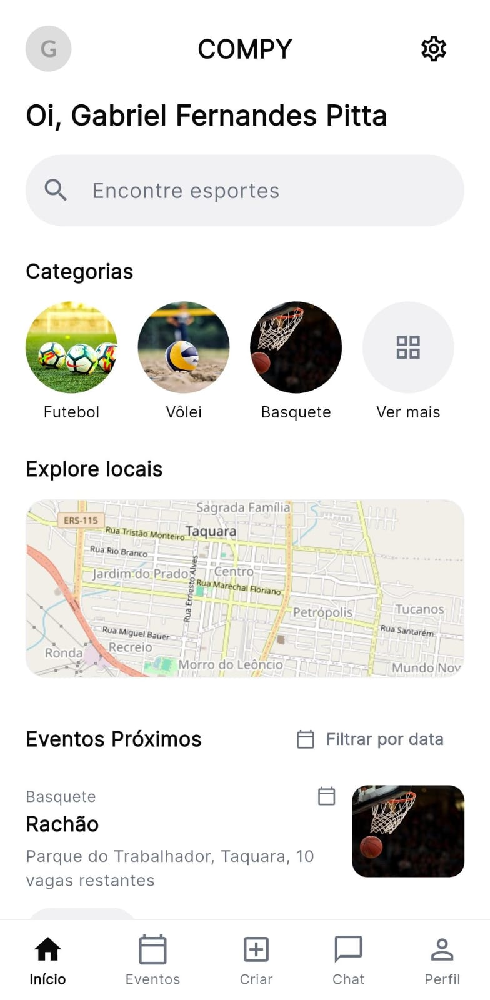
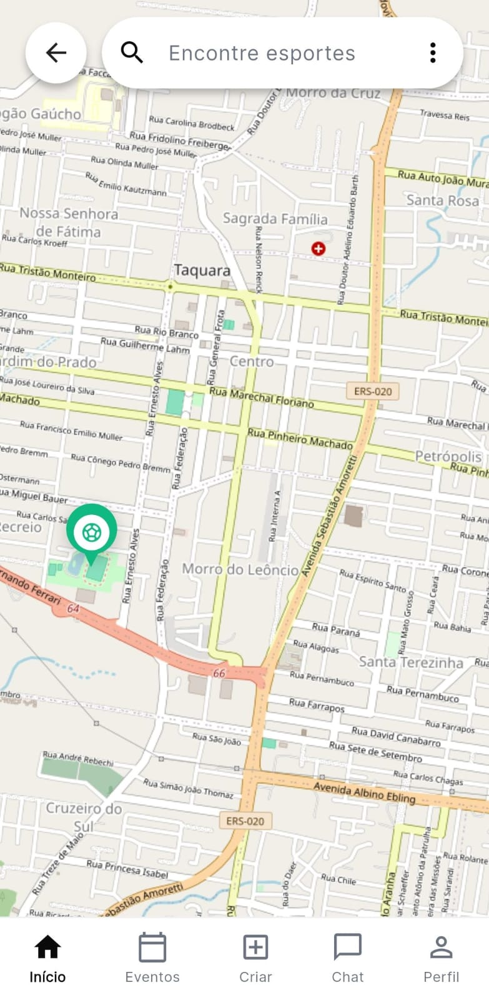
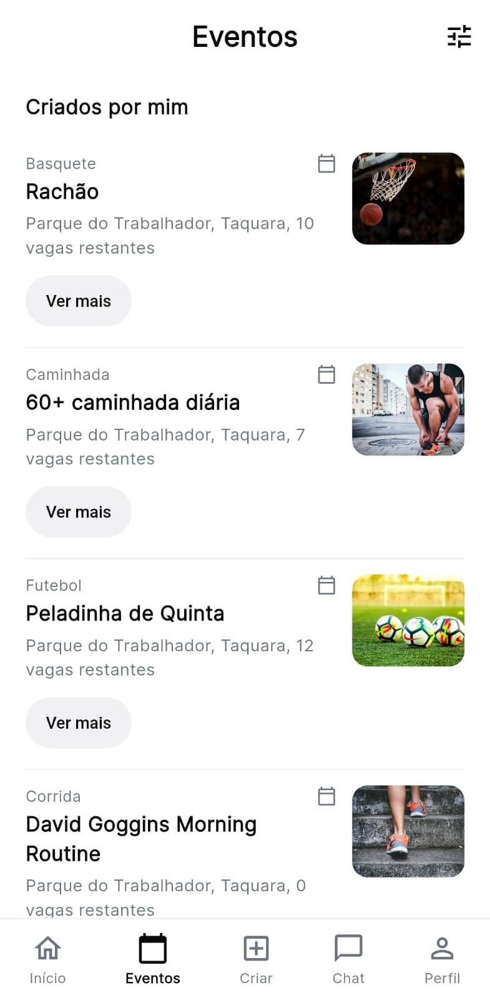
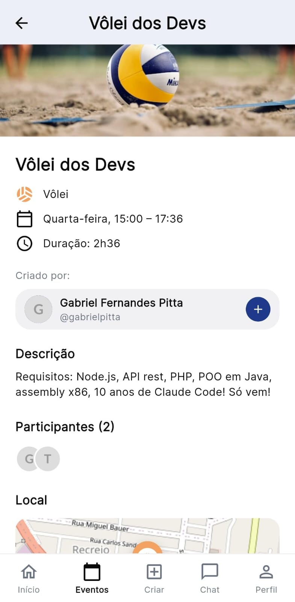
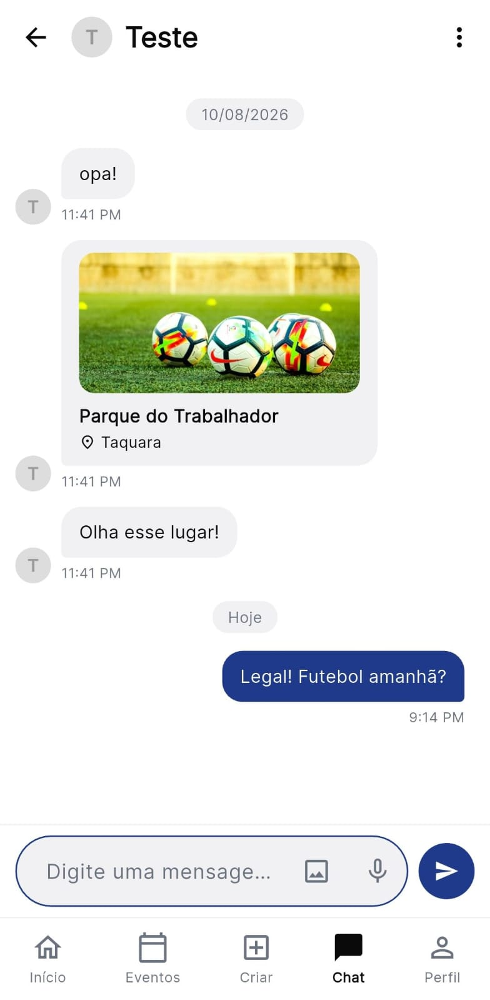
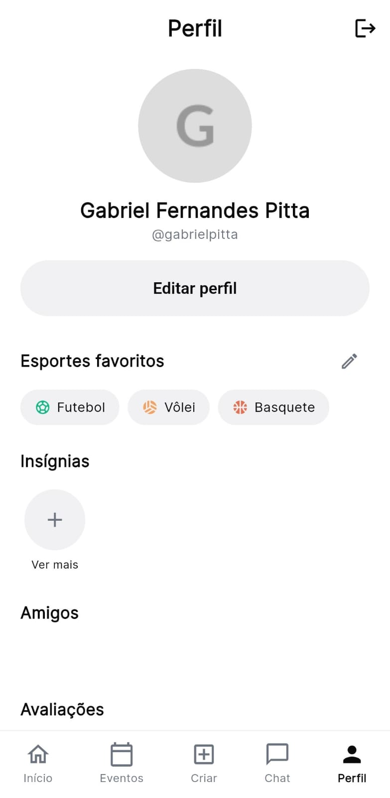

<div align="center">

<picture>
  <source media="(prefers-color-scheme: dark)" srcset="docs/assets/banner-dark.png">
  <source media="(prefers-color-scheme: light)" srcset="docs/assets/banner-light.png">
  
</picture>

### Marcou o jogo? Agora é só aparecer.

Aplicativo móvel que conecta praticantes de esporte em **Taquara/RS**.

<br>

[](https://flutter.dev)
[](https://dart.dev)
[](https://firebase.google.com)
[](https://riverpod.dev)
[](https://pub.dev/packages/go_router)
[](https://openstreetmap.org)
[](android/app/build.gradle.kts)


</div>

---

## Sobre o projeto

O **COMPY** resolve um problema simples de quem gosta de esporte: querer jogar e não ter com quem. O app reúne num lugar só os eventos esportivos abertos de **Taquara/RS** — a pelada de quinta, o vôlei no fim da tarde, a corrida de sábado cedo —, mostra no mapa onde cada um acontece, quantas vagas ainda restam e quem está organizando. Dá para entrar num evento com um toque, criar o seu próprio e combinar os detalhes pelo chat, sem sair do aplicativo. É o **Trabalho de Conclusão de Curso** de **Gabriel Fernandes Pitta** e **Bernardo Pedroso Finkler**, alunos do 3º ano do curso Técnico em Informática integrado ao ensino médio da **Escola Técnica Estadual Monteiro Lobato (CIMOL)**, em Taquara/RS.

---

## O que dá para fazer

| | Tela | Recursos |
|:--:|---|---|
| 🏠 | **Início** | Saudação com o nome de quem entrou, categorias por modalidade, prévia do mapa e os **eventos próximos** — busca real por raio de 10 km a partir da sua localização. Campo de busca por nome do evento ou modalidade. |
| 🗺️ | **Mapa** | Locais esportivos da cidade em um mapa OpenStreetMap, com ficha do local (modalidades aceitas, avaliação e atalho para criar um evento ali). |
| 📅 | **Eventos** | Lista em três seções — *Criados por mim*, *Participando* e *Todos os eventos* — com filtros de modalidade, nível de habilidade e data. O detalhe traz local, horário, duração, vagas restantes e a lista de participantes. |
| ➕ | **Criar** | Título, modalidade, local, data, horário, duração, nível de habilidade, número de participantes e descrição. |
| 💬 | **Chat** | Conversas em tempo real entre os participantes, direto sobre os streams do Firestore, com envio do local do evento como cartão na conversa. |
| 👤 | **Perfil** | Avatar, esportes favoritos, insígnias, amigos, avaliações e galeria; troca de nome de usuário e exclusão da conta. |

**Entrada no app:** cadastro e login por e-mail/senha ou **conta Google**, escolha de um nome de usuário único e onboarding de esportes favoritos — tudo protegido por um guard de rotas que leva cada pessoa exatamente ao degrau que falta.

**Modalidades:** futebol · futsal · vôlei · basquete · tênis de mesa · corrida · ciclismo · caminhada

---

## Telas

<div align="center">

| Início | Mapa | Eventos |
|:--:|:--:|:--:|
|  |  |  |
| **Detalhe do evento** | **Chat** | **Perfil** |
|  |  |  |

</div>

---

## Tecnologias

| Camada | Ferramenta | Papel no app |
|---|---|---|
| App | **Flutter 3.22+** / **Dart 3.4+** | Base do aplicativo, Android como plataforma alvo |
| Estado | **Riverpod 2.5** | Injeção de dependências e cache de providers |
| Navegação | **GoRouter 14.2** | `StatefulShellRoute.indexedStack` com as 5 abas e o guard de autenticação |
| Autenticação | **Firebase Auth** + **google_sign_in** | E-mail/senha e conta Google |
| Banco | **Cloud Firestore** (`compy-tcc`, `southamerica-east1`) | Perfis, eventos, conversas e mensagens, em tempo real |
| Proteção | **Firebase App Check** + `firestore.rules` | Regras por papel: dono do perfil, criador do evento, membro da conversa |
| Mapa | **flutter_map 7** + **OpenStreetMap** | Mapa e pins sem nenhuma chave de API |
| Localização | **geolocator** | Raio real dos eventos próximos |
| Interface | **google_fonts**, **cached_network_image** | Tipografia e imagens de rede com cache |

---

## Arquitetura

**Clean Architecture feature-first.** Cada funcionalidade é uma pasta com as três camadas dentro, e nada fora dela precisa saber como ela guarda os dados.

```
lib/
├── core/            # tema, rotas, serviços, constantes e utilitários
├── features/        # auth · home · maps · events · chat · profile
│   └── <feature>/
│       ├── domain/         # entidades, contratos de repositório e casos de uso (Dart puro)
│       ├── data/           # implementações + datasource do Firestore e mock
│       └── presentation/   # páginas, widgets e providers Riverpod
└── shared/          # modelos e widgets usados por mais de uma feature
```

A injeção segue sempre a mesma corrente:

```
datasource  →  repositório  →  caso de uso  →  provider de tela
```

As features que dependem de backend têm **dois datasources**: um do Firestore e um mock em memória. Quem escolhe é a flag `kUseFirebaseRepos`, em [`lib/core/constants/app_flags.dart`](lib/core/constants/app_flags.dart) — com ela em `false`, o app roda inteiro sem backend nenhum, o que salva o desenvolvimento offline e a apresentação sem internet. A exceção é o catálogo de locais esportivos: ele é curado pela equipe, muda pouco e por isso vive no próprio código.

**Arquivos que valem conhecer primeiro:**

| Arquivo | O que guarda |
|---|---|
| [`lib/core/routes/app_router.dart`](lib/core/routes/app_router.dart) | Todas as rotas e o guard de autenticação (função pura, testada rota a rota) |
| [`lib/core/constants/app_strings.dart`](lib/core/constants/app_strings.dart) | Todos os textos da interface, em PT-BR |
| [`lib/core/theme/app_colors.dart`](lib/core/theme/app_colors.dart) | Paleta com contraste WCAG AA |
| [`firestore.rules`](firestore.rules) | Quem pode ler e escrever cada coleção |

> Os requisitos do TCC ficam marcados nos comentários do código: `grep -rn "RF0" lib` mostra onde cada requisito funcional foi implementado — o mesmo vale para `RN-` e `RNF`.

---

## Como rodar

**Pré-requisitos:** Flutter SDK 3.22 ou superior, Android Studio com o SDK do Android, e um dispositivo ou emulador Android.

```bash
git clone https://github.com/GabrielPittaBr/MVP_COMPY.git
cd MVP_COMPY

flutter pub get

# gera lib/firebase_options.dart e android/app/google-services.json
dart pub global activate flutterfire_cli
flutterfire configure

flutter run
```

> **Por que o passo do `flutterfire configure`?** `lib/firebase_options.dart` e `google-services.json` carregam chaves do projeto e por isso ficam fora do Git. Sem eles o app **ainda abre**: `FirebaseService.ensureInitialized()` trata a falha e a aplicação cai nos dados mockados. Para forçar esse modo de propósito, basta trocar `useFirebaseRepos` para `false` em `lib/core/constants/app_flags.dart`.

---

## Testes e qualidade

```bash
flutter test     # 169 testes de unidade e de widget
dart analyze     # analisador estático — sem erros (só sugestões de estilo)
```

As regras do Firestore têm suíte própria, em Node, porque não há como testá-las a partir do Dart. Ela roda contra o emulador e **nunca toca o projeto real** — precisa de JDK 21+ no PATH:

```bash
npm install --prefix tools/firestore-rules-tests   # uma vez
npm test --prefix tools/firestore-rules-tests      # 83 casos
```

---

## Estrutura do repositório

| Caminho | Conteúdo |
|---|---|
| `lib/` | Código do aplicativo |
| `test/` | Testes de unidade e de widget |
| `assets/images/` | Logo e ícone do app |
| `firestore.rules` · `firestore.indexes.json` | Regras de segurança e índices do Firestore |
| `tools/firestore-rules-tests/` | Suíte Node que exercita as regras no emulador |
| `docs/` | Roadmap, checklist de publicação, decisões de produto e notas de depuração |

---

## Fluxo de trabalho

O repositório segue **Gitflow**:

```
main  ←  develop  ←  feature/… · fix/… · refactor/… · chore/… · style/…
```

`main` guarda o que está estável e versionado; `develop` recebe as branches de trabalho; releases sobem de `develop` para `main`. A v0.1.0 já saiu assinada, com pacote definitivo `br.com.compy.app`.

---

## Próximos passos

- Avaliação pós-evento de participantes, evento e local — as regras do Firestore já preveem a coleção
- Encerramento do evento e o card de "evento em andamento"
- Upload de foto de perfil
- Ampliação do catálogo de locais esportivos da cidade
- Telas de configurações e de insígnias, hoje em construção

O planejamento completo, com tamanho e critério de aceite de cada tarefa, está em [`docs/roadmap-prioridade-alta.md`](docs/roadmap-prioridade-alta.md).

---

## Autores

<div align="center">

| <br>**Gabriel Fernandes Pitta**<br>[@GabrielPittaBr](https://github.com/GabrielPittaBr) | <br>**Bernardo Pedroso Finkler**<br>[@BeFinkler](https://github.com/BeFinkler) |
|:--:|:--:|

</div>

---

## Instituição

<div align="center">


&nbsp;&nbsp;&nbsp;&nbsp;&nbsp;&nbsp;


**Escola Técnica Estadual Monteiro Lobato — CIMOL**<br>
Curso Técnico em Informática · Taquara/RS

</div>

---

## Licença

Projeto acadêmico, desenvolvido como Trabalho de Conclusão de Curso. O código está publicado para consulta e avaliação; qualquer outro uso deve ser combinado com os autores.

<div align="center">
<sub>Feito em Taquara/RS 💚</sub>
</div>
