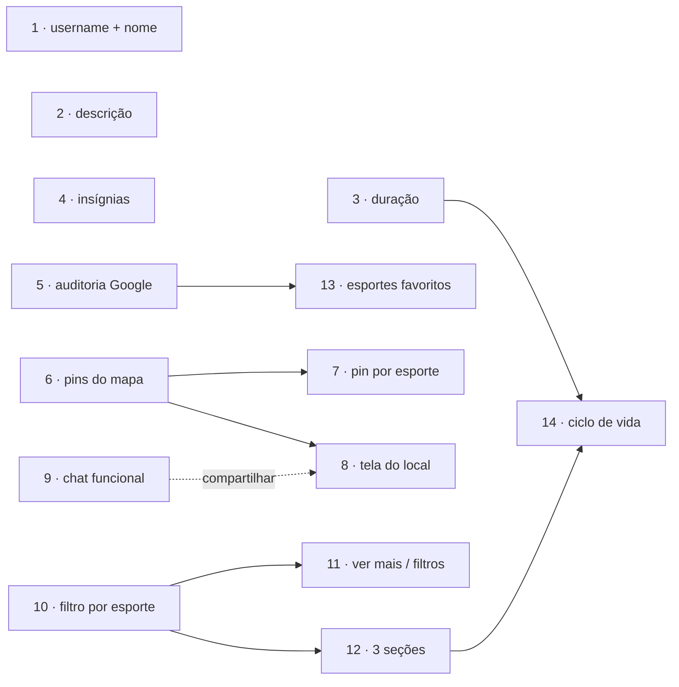

# Roadmap — Prioridade Alta

> Documento gerado em 2026-08-08 a partir do estado atual do código (`develop` @ `a6fc9fc`).
> Revisado em 2026-08-09 com as decisões de produto respondidas — ver [Registro de decisões](#registro-de-decisões).
> Complementa [`proximos-passos.md`](proximos-passos.md), que continua válido para as prioridades média e baixa.

---

## Como ler este documento

As ideias levantadas foram reordenadas em **ordem de implementação**, não em ordem de importância. O critério foi:

1. **Dependência técnica** — tarefas que desbloqueiam outras vêm antes.
2. **Custo x risco** — quick wins isolados primeiro, para o `develop` ganhar valor rápido sem risco de conflito.
3. **Blast radius** — o que mexe em model/router/guard fica por último, para não brigar com as branches menores em andamento.

Cada tarefa traz: objetivo, o que precisa ser feito, arquivos-chave, critérios de aceite, nome de branch e se precisa de `/to-tickets`.

**Legenda de tamanho:** `P` = uma sessão curta · `M` = uma sessão de trabalho · `G` = várias sessões, precisa quebrar.

Tarefas que exigem mudança em `firestore.rules` trazem um bloco **🔒 Regras do Firestore** com o que precisa ser decidido. Ver também a [seção consolidada](#regras-do-firestore--trabalho-pendente).

---

## Registro de decisões

Respostas dadas em 2026-08-09, já incorporadas nas tarefas:

| # | Decisão |
|---|---|
| D1 | **"Parcão" é apelido pessoal do Parque do Trabalhador.** Não vai para lugar nenhum na UI. A tarefa 6 não tem local novo: é só fazer o pin do Parque do Trabalhador aparecer. |
| D2 | **Descrição do evento é opcional e sem fallback** — se o usuário não escrever, fica vazia. O placeholder explica o que colocar. |
| D3 | **A aba Eventos ganha 3 seções** com divisória: "Criados por mim", "Participando" e "Todos os eventos". Duplicação entre seções é aceita. |
| D4 | **Sem migração de usuários** no onboarding de esportes favoritos — ainda não há usuários reais. |
| D5 | **Evento em andamento** aparece como card acima das 3 seções, **e somente se o usuário estiver participando**. Botão "Encerrar" só para o criador. Se ele esquecer, encerra sozinho **1 hora depois do fim previsto**; ao reabrir o app, o criador vê o aviso e cai na mesma tela de finalização. |
| D6 | **Presença não distingue "inscrito" de "compareceu"** por enquanto. |
| D7 | **Avaliação cobre 3 alvos:** participantes (incluindo o organizador), o evento e o local. Avaliar evento e local é **obrigatório**; participantes é opcional. |
| D8 | **Duração do evento vira campo próprio** — tarefa 3, pré-requisito da 14. **Obrigatória, com 1h pré-selecionado.** |
| D9 | **No cadastro pós-Google o usuário pode editar o nome completo, mas não o e-mail.** Incorporado à tarefa 1. |
| D10 | **A tela de local é o `PlaceDetailsSheet` que já existe** — bate com o desenho. **Não criar outra tela.** |
| D11 | **Botão "Favoritar" sai** da tela de local — não há onde guardar favoritos. **"Compartilhar" fica para depois do chat funcional** (tarefa 9), que virou tarefa própria. |
| D12 | **A regra de "menos de 3 estrelas exige justificativa" vale para os três alvos** — participante, evento e local. |
| D13 | **Comentários de avaliação não são públicos** por enquanto — não há onde exibi-los. Guardar tudo, mostrar só a média. |

---

## Achados que mudam o plano

Cinco coisas encontradas ao ler o código. Elas alteram o escopo de algumas ideias:

### 1. O mapa hoje não mostra pin nenhum

`AppFlags.useFirebaseRepos` está `true` ([app_flags.dart:6](../lib/core/constants/app_flags.dart)), e nesse caminho o `PlacesRepositoryImpl.getAll()` retorna lista vazia com um `TODO` no lugar do mapper:

```dart
// lib/features/maps/data/repositories/places_repository_impl.dart:14-18
Future<List<SportPlace>> getAll() async {
  if (!kUseFirebaseRepos) return MockPlaces.all;
  // TODO(integração): mapear QuerySnapshot -> List<SportPlace>.
  return <SportPlace>[];
}
```

"O pin do Parque do Trabalhador não aparece" não é caso isolado — **nenhum** dos 6 locais de `MockPlaces` aparece. A tarefa 6 é "religar o pipeline de locais", não "adicionar um local".

### 2. Existem dois catálogos de locais, e o do mapa não é o mesmo de criar evento

| | Usado por | Entidade | Lista de esportes? | Aparece no mapa? |
|---|---|---|---|---|
| `MockPlaces.all` | Mapa | `SportPlace` | Não — um `sport` só | Deveria (hoje não, ver achado 1) |
| `EventLocation.all` | Criar evento | `EventLocation` | Sim — `allowedSports` | **Nunca** |

Confirma a observação levantada: o `CustomSportMarker` **não é aplicado** aos locais de `event_location.dart` — o `MarkerLayer` da `MapsPage` só itera sobre `placesProvider`, que vem de `SportPlace`. `EventLocation` nunca chega perto do mapa.

Os dois catálogos divergem nas coordenadas do mesmo lugar: `MockPlaces` tem "Campo do Parque do Trabalhador" em `(-29.6520, -50.7825)` e `EventLocation.parqueDoTrabalhador` em `(-29.656276, -50.787726)`. Enquanto forem duas listas, todo local novo precisa ser cadastrado duas vezes.

### 3. A tela de detalhes do local já está pronta

`PlaceDetailsSheet` já tem banner, nome, endereço, avaliação com estrelas, botão "Criar evento" e a seção "Informações" ([place_details_sheet.dart](../lib/features/maps/presentation/widgets/place_details_sheet.dart)). Confirmado por D10: **é o desenho certo, não criar outra tela**. Ela nunca aparece por causa do achado 1, e as três ações são stubs vazios. A tarefa 8 é ligar o que existe.

### 4. `participants` é um array de mapas — não dá para consultar "eventos que participo"

`Event.participants` é serializado como lista de mapas de `UserSummary` ([event.dart:70](../lib/shared/models/event.dart)). O `arrayContains` do Firestore exige o **mapa inteiro, idêntico**; se o usuário trocar de avatar ou nome, a consulta para de encontrar os eventos dele. A seção "Participando" (D3) precisa de um campo desnormalizado `participantIds: List<String>`. É o risco escondido da tarefa 12.

### 5. O chat carrega conversas mas nunca mostra mensagem nenhuma

Perguntado se havia algo pronto do chat: **há bastante — e há um bug que deixa a aba inteira inútil.**

```dart
// lib/features/chat/data/repositories/chat_repository_impl.dart:92-98
Stream<List<Message>> watchMessages(String conversationId) {
  if (!kUseFirebaseRepos) {
    return InMemoryChatStore.instance.watchMessages(conversationId);
  }
  return const Stream<List<Message>>.empty();   // ← nunca chama o datasource
}
```

`ChatRemoteDataSource.watchMessages()` está **implementado e correto** ([chat_remote_datasource.dart:32-39](../lib/features/chat/data/datasources/chat_remote_datasource.dart)) — só nunca é chamado. Com `kUseFirebaseRepos = true`, toda sala de chat abre vazia, para sempre. O inventário completo está na [tarefa 9](#9-chat-funcional).

---

## Regras do Firestore — trabalho pendente

`firestore.rules` hoje já não é mais `allow read, write: if false` (o `CLAUDE.md` está desatualizado nesse ponto), mas as regras atuais são permissivas demais em três coleções. Cinco tarefas mexem nelas, e **em todas é preciso decidir a regra nova antes de codar** — não deixar para o fim:

| Tarefa | Coleção | Situação hoje | O que precisa ser decidido |
|---|---|---|---|
| 5 | `usernames` | Só `create` permitido | Permitir `update` do próprio doc, senão o re-cadastro quebra |
| 6 | `places` | `read: if signedIn()` | Se o catálogo virar código, a regra vira letra morta — remover ou manter |
| 9 | `conversations` + `messages` | `read, write: if signedIn()` | **Qualquer autenticado lê qualquer conversa alheia.** Restringir a membros |
| 12 | `events` | `create, update: if signedIn()` | **Qualquer autenticado edita qualquer evento.** Restringir campos por papel |
| 13 | `users` | ✅ Feito | `favoriteSports` no `hasOnly` com limite de 8; e-mail movido para `users/{uid}/private/contact`, legível só pelo dono (RN-06) |
| 14 | `ratings` (nova) | Não existe → negado por padrão | Escrever do zero: quem pode criar, editar, ler |

Regra prática para as três coleções abertas: `signedIn()` autoriza **o app**, não **o usuário certo**. Como o app já tem uid real em todo lugar, dá para apertar sem perder funcionalidade.

---

## Ordem de implementação

| # | Tarefa | Branch | Tam. | Depende de | `/to-tickets`? | 🔒 |
|---|---|---|---|---|---|---|
| 1 | Username limitado + editar nome no pós-Google | `fix/cadastro-username-e-nome` | P | — | Não | |
| 2 | Descrição escrita pelo usuário ao criar evento | `feature/descricao-evento` | P | — | Não | |
| 3 | Duração do evento | `feature/duracao-evento` | P/M | — | Não | |
| 4 | Página de insígnias | `feature/tela-insignias` | P | — | Não | |
| 5 | Auditoria do cadastro via Google | `chore/auditoria-login-google` | P/M | — | Não | 🔒 |
| 6 | Pins do mapa voltarem a aparecer | `fix/pins-mapa-locais` | M | — | Não | 🔒 |
| 7 | Pin com ícone e cor do primeiro esporte | `feature/pin-por-esporte` | P | 6 | Não | |
| 8 | Ligar a tela de detalhes do local | `feature/tela-detalhes-local` | P/M | 6 | Não | |
| 9 | Chat funcional | `feature/chat-funcional` | G | — | **Sim** | 🔒 |
| 10 | Categorias da Home → aba Eventos, filtrando de verdade | `feature/filtro-esportes-eventos` | M | — | Não | |
| 11 | "Ver mais" nas categorias + tela de filtros | `feature/ver-mais-categorias` | M | 10 | Não | |
| 12 | Três seções na aba Eventos | `feature/secoes-aba-eventos` | M/G | 10 | Não | 🔒 |
| 13 | Onboarding de esportes favoritos no cadastro | `feature/onboarding-esportes-favoritos` | G | 5 | **Sim** | 🔒 |
| 14 | Ciclo de vida do evento: durante, pós e avaliação | `feature/ciclo-vida-evento` | G | 3, 12 | **Sim** | 🔒 |



As tarefas 1–6, 9 e 10 são independentes entre si e podem ser feitas em qualquer ordem, ou em paralelo.

**Por que a 3 (duração) foi puxada para o começo:** é pequena, mas adiciona campo em `Event`. Fazê-la agora evita mexer duas vezes no model, no `toMap`/`fromMap` e nos mocks quando a 14 precisar de `endsAt`.

**Por que a 9 (chat) está no meio:** ela não bloqueia nada estruturalmente, mas a aba Chat está **visivelmente quebrada hoje** (achado 5) e a primeira fatia dela é um conserto de poucas linhas. Deixá-la para o fim seria manter uma das 5 abas do app inútil durante todo o roadmap. O "Compartilhar" da tarefa 8 também depende dela.

---

## 1. Username limitado + editar nome no cadastro pós-Google

**Branch:** `fix/cadastro-username-e-nome` · **Tamanho:** P · **`/to-tickets`:** não

### Objetivo

Duas correções no mesmo formulário, por isso vão juntas:

- **(a)** Impedir usernames absurdos — muito longos, muito curtos ou com caracteres que quebram a exibição.
- **(b)** Deixar o usuário corrigir o **nome completo** na tela pós-login Google. O e-mail continua bloqueado.

### Situação atual

**(a)** Os dois formulários validam apenas "não vazio", sem `maxLength`, `inputFormatters` ou validação de formato:

- [signup_page.dart:88-90](../lib/features/auth/presentation/pages/signup_page.dart) — cadastro por e-mail.
- [username_page.dart:96-98](../lib/features/auth/presentation/pages/username_page.dart) — pós-login Google.

O `AuthTextField` também não expõe esses parâmetros ([auth_text_field.dart](../lib/features/auth/presentation/widgets/auth_text_field.dart)).

**(b)** Na `UsernamePage`, nome e e-mail são `readOnly: true` ([username_page.dart:74-87](../lib/features/auth/presentation/pages/username_page.dart)). O nome vem de `widget.user.displayName`, ou seja, do perfil Google — e vai direto para o Firestore em `setUsername()` sem chance de ajuste. Quem tem o Google configurado como "joao123" fica com isso de nome no app para sempre.

### O que fazer

**(a) Limite do username**

- Definir a regra e centralizá-la — sugestão: **3 a 20 caracteres**, apenas `a-z`, `0-9`, `_` e `.`, sem começar/terminar com ponto. Criar um `UsernameRules` (ou validador estático) em `lib/core/utils/` para que as duas telas usem a mesma regra, em vez de duplicar regex.
- Expor `maxLength` e `inputFormatters` no `AuthTextField`, repassando ao `TextFormField`.
- Aplicar `LengthLimitingTextInputFormatter(20)` + `FilteringTextInputFormatter.allow(RegExp(r'[a-z0-9._]'))` nos dois campos. O datasource já faz `toLowerCase()`, então forçar minúscula na digitação evita a surpresa de "digitei João e virou joao".
- Mensagens novas em `app_strings.dart`: `authErrorUsernameTooShort`, `authErrorUsernameTooLong`, `authErrorUsernameInvalidChars`.

**(b) Nome editável no pós-Google**

- Trocar o campo de nome da `UsernamePage` de `readOnly` para editável, com `controller` próprio (hoje usa `initialValue`), pré-preenchido com o `displayName` do Google.
- Validar como no cadastro por e-mail: não vazio, com `maxLength` (sugestão: 60).
- Manter o **e-mail `readOnly`** — é a chave da credencial Google; alterá-lo ali não mudaria nada no Firebase Auth, só criaria divergência entre o que o Auth sabe e o que o Firestore guarda.
- `_submit()` já passa `name:` para `setUsername()` — trocar `widget.user.displayName` pelo valor do controller.
- Propagar para o Firebase Auth também: chamar `firebaseUser.updateDisplayName()` dentro de `setUsername()`, como já é feito em `signUpWithEmail()` ([auth_remote_datasource.dart:87](../lib/features/auth/data/datasources/auth_remote_datasource.dart)). Sem isso, `users/{uid}.name` e `AuthUser.displayName` divergem — e a saudação da Home lê o **segundo** (`greetingNameProvider`), então o nome corrigido não apareceria lá.

### Arquivos-chave

- `lib/features/auth/presentation/widgets/auth_text_field.dart`
- `lib/features/auth/presentation/pages/signup_page.dart`
- `lib/features/auth/presentation/pages/username_page.dart`
- `lib/features/auth/data/datasources/auth_remote_datasource.dart` (`setUsername`)
- `lib/core/constants/app_strings.dart`
- `lib/core/utils/` (novo arquivo de validação)

### Critérios de aceite

- Não é possível enviar o formulário com username fora da faixa definida, nos dois fluxos.
- Na tela pós-Google o nome é editável e o e-mail não.
- O nome corrigido aparece na saudação da Home e no perfil.

---

## 2. Adicionar descrição ao criar evento

**Branch:** `feature/descricao-evento` · **Tamanho:** P · **`/to-tickets`:** não

### Objetivo

Substituir a descrição gerada automaticamente por um texto escrito pelo criador.

### Situação atual

A descrição é montada no submit, com o texto que se quer eliminar:

```dart
// lib/features/events/presentation/pages/create_event_page.dart:284-286
description:
    'Partida de ${sport.label.toLowerCase()} no ${location.name}, '
    'em ${location.city}.',
```

O campo `description` já existe em `Event`, já é serializado em `toMap()`/`fromMap()` e já é exibido em [event_detail_page.dart:105](../lib/features/events/presentation/pages/event_detail_page.dart). Falta só a entrada.

### O que fazer

- Adicionar um `_descriptionCtrl` na `CreateEventPage` e um `EventFormField` multilinha (3–4 linhas) depois do campo de número de participantes.
- `EventFormField` hoje não repassa `maxLines` — o `RoundedTextField` embaixo dele já suporta ([rounded_text_field.dart:25](../lib/shared/widgets/rounded_text_field.dart)). Basta adicionar o parâmetro e repassar.
- Limitar com `maxLength` (sugestão: 300 caracteres).
- **Campo opcional e sem fallback (D2):** vazio é vazio. Remover a frase automática de `_submit()`.
- **Placeholder explicativo**, já que é ele quem ensina o que escrever. Sugestão: `"Conte como vai ser o jogo: leve bola? tem colete? é competitivo ou de boa?"` — concreto o suficiente para o usuário não travar diante de um campo em branco.
- Tratar a exibição do vazio em `EventDetailPage`: hoje é um `Text(event.description)` solto, que com string vazia deixa um `SizedBox(height: 24)` órfão no meio do layout. Esconder o bloco inteiro quando não houver descrição.
- Registrar (sem obrigação de resolver aqui): o `title` é sempre `'Partida de <esporte>'` e a tela de detalhes ignora o título salvo, exibindo `'Partida de ${event.sport.label}'` hardcoded em [event_detail_page.dart:81](../lib/features/events/presentation/pages/event_detail_page.dart).
- Strings novas: `eventDescription`, `eventDescriptionHint`.

### Arquivos-chave

- `lib/features/events/presentation/pages/create_event_page.dart`
- `lib/features/events/presentation/widgets/event_form_field.dart`
- `lib/features/events/presentation/pages/event_detail_page.dart`
- `lib/core/constants/app_strings.dart`

### Critérios de aceite

- A descrição digitada aparece igual na tela de detalhes.
- Deixar em branco não gera texto automático nem espaço vazio no layout.

---

## 3. Duração do evento

**Branch:** `feature/duracao-evento` · **Tamanho:** P/M · **`/to-tickets`:** não

### Objetivo

O criador informa quanto tempo o evento dura; a duração aparece na tela de detalhes ("Ver mais"). **Pré-requisito da tarefa 14** — sem fim previsto não há como encerrar evento automaticamente nem saber o que está "acontecendo agora".

### Situação atual

`Event` tem `dateTime` (início) e nada mais sobre tempo ([event.dart](../lib/shared/models/event.dart)). Não existe duração, fim nem status.

### O que fazer

- Adicionar `durationMinutes` (int) ao `Event`, ao `toMap()`/`fromMap()`, ao `copyWith` e ao `props`.
- Adicionar **também** um `endsAt` (Timestamp) desnormalizado em `toMap()`, calculado como `dateTime + durationMinutes`. O Firestore não calcula nada em consulta: sem esse campo, "esconder eventos encerrados" e "acontecendo agora" viram filtro no cliente, o que quebra a paginação (mesmo problema descrito na tarefa 10). Gravar os dois: `durationMinutes` para exibir, `endsAt` para consultar.
- Novo campo no formulário — seletor, não texto livre. Bottom sheet com opções fixas (30min, **1h**, 1h30, 2h, 3h) e "Outro" abrindo um input. O formulário inteiro já usa esse padrão de `readOnly` + `showModalBottomSheet` (`_pickSkill`, `_pickSport`), então é só seguir.
- **Obrigatória, com 1h pré-selecionado (D8).** Como já vem preenchida, incluí-la em `_canSubmit()` é redundante — mas vale garantir que o valor nunca chegue nulo ao `_submit()`.
- Exibir na `EventDetailPage` como mais um `_IconRow` (`Icons.schedule`) logo abaixo da data. Formatar amigável: "1h", "1h30", "45min" — não "60 minutos". Vale um helper em `lib/core/utils/`.
- Considerar mostrar o horário de término junto do início ("Sáb, 15:00 – 16:00"), mais útil que a duração isolada.
- Atualizar as fixtures do `InMemoryEventsStore` e do `MockEvents`.
- **Eventos já criados no Firestore não têm o campo.** Com poucos eventos de teste, o mais barato é apagá-los. Se preferir manter, `fromMap` precisa de default (60) e `endsAt` derivado na leitura quando ausente.

### Arquivos-chave

- `lib/shared/models/event.dart`
- `lib/features/events/presentation/pages/create_event_page.dart`
- `lib/features/events/presentation/pages/event_detail_page.dart`
- `lib/features/events/data/datasources/in_memory_events_store.dart`
- `lib/features/home/data/datasources/mock_events.dart`
- `lib/core/constants/app_strings.dart`

### Critérios de aceite

- Criar evento vem com 1h pré-selecionado e permite trocar.
- A tela de detalhes mostra duração e/ou horário de término formatados.
- `endsAt` é gravado corretamente no Firestore.

---

## 4. Página das insígnias

**Branch:** `feature/tela-insignias` · **Tamanho:** P · **`/to-tickets`:** não

### Objetivo

Dar destino ao "Ver mais" das insígnias no perfil — hoje é um `CircleAvatar` decorativo, sem `onTap`.

### Situação atual

- [badges_row.dart:39-50](../lib/features/profile/presentation/widgets/badges_row.dart) — o botão "Ver mais" não é clicável.
- `ProfileRepositoryImpl` devolve `badges: const []` ao ler do Firestore ([profile_repository_impl.dart:32](../lib/features/profile/data/repositories/profile_repository_impl.dart)), então a lista está sempre vazia; as insígnias bonitas só existem em `MockProfile`.
- Não há regra de conquista definida em lugar nenhum.

### O que fazer

Escopo deliberadamente pequeno — é uma vitrine, não o sistema de gamificação:

- Criar `BadgesPage` em `lib/features/profile/presentation/pages/badges_page.dart`.
- Registrar a rota `/profile/badges` como sub-rota do branch 4 (Perfil) em `app_router.dart`, preservando o bottom nav — mesmo padrão de `/home/maps`.
- Tornar o "Ver mais" clicável, navegando para lá.
- Conteúdo: grid com o catálogo de insígnias previstas (usar `SportBadge` e as três de `MockProfile` como base), com as não conquistadas em cinza/opacidade reduzida, e um aviso claro de "Em breve — as insígnias serão desbloqueadas conforme você participa de eventos". Um estado estático honesto é melhor que uma tela vazia.
- Strings: `badgesTitle`, `badgesComingSoon`, `badgesLocked`.

### Arquivos-chave

- `lib/features/profile/presentation/widgets/badges_row.dart`
- `lib/features/profile/presentation/pages/badges_page.dart` (novo)
- `lib/core/routes/app_router.dart`
- `lib/core/constants/app_strings.dart`

### Critérios de aceite

- Tocar em "Ver mais" abre a tela, com o bottom nav ainda visível.
- O botão de voltar retorna ao perfil sem perder o scroll.

---

## 5. Verificar se logar com Google já cria a conta direto

**Branch:** `chore/auditoria-login-google` · **Tamanho:** P/M · **`/to-tickets`:** não

### Objetivo

Responder com certeza o que acontece no primeiro login Google e corrigir as falhas que a auditoria confirmar. **Precisa vir antes da tarefa 13**, porque define onde o passo de esportes favoritos se encaixa.

### Resposta preliminar (a confirmar rodando)

Lendo [auth_remote_datasource.dart:109-136](../lib/features/auth/data/datasources/auth_remote_datasource.dart): **a conta do Firebase Auth é criada automaticamente** por `signInWithCredential` — não há passo de "cadastro". Mas o **perfil no Firestore (`users/{uid}`) não é criado ali**: só é gravado em `setUsername()`. Como o guard do router usa `hasUsername` ([app_router.dart:96](../lib/core/routes/app_router.dart)), o usuário Google novo cai em `/username` e só entra no app depois de escolher o username.

Conta sim, perfil não. Esse descompasso gera três casos de borda:

1. **Conta órfã.** Fechar o app na tela `/username` deixa uma conta no Auth sem documento em `users/`. No próximo login ele volta para `/username` — não quebra, mas suja a base.
2. **Falso negativo em rede ruim.** `_userHasProfile()` tem `timeout(10s)` e devolve `false` no catch ([auth_remote_datasource.dart:197-210](../lib/features/auth/data/datasources/auth_remote_datasource.dart)). Um usuário **já cadastrado** com internet lenta é mandado para `/username` — e ao confirmar o próprio username, `isUsernameAvailable()` retorna `false` e ele leva `UsernameAlreadyTakenException` no username dele mesmo. Bug real.
3. **Regra do Firestore.** `_writeUserProfile` faz `batch.set` em `usernames/{username}`; se o doc já existir isso é *update*, e as regras só permitem `create`. Segunda forma de o mesmo cenário falhar.

### O que fazer

- Rodar o fluxo com uma conta Google nova e conferir no console do Firebase (Authentication → Users e Firestore → `users`) em que momento cada registro aparece.
- Corrigir o item 2: `isUsernameAvailable()` deve considerar disponível o username cujo doc já aponta para o **mesmo uid**.
- Corrigir o item 3: `SetOptions(merge: true)` no doc de username.
- Reavaliar o `return false` no catch de `_userHasProfile` — falhar para um estado de erro explícito é melhor que empurrar o usuário para o cadastro.
- Registrar as conclusões em `docs/autenticacao.md`.

### 🔒 Regras do Firestore

**Precisa decidir e escrever antes de fechar a tarefa.** A coleção `usernames` hoje permite apenas `create`:

```
match /usernames/{username} {
  allow read: if true;
  allow create: if signedIn() && request.resource.data.uid == request.auth.uid;
}
```

Regra a definir: permitir `update` quando o doc **já pertence ao mesmo uid** (`resource.data.uid == request.auth.uid`), para o re-cadastro do item 3 não estourar. Decidir também se `read: if true` continua aberto — é necessário para checar disponibilidade **antes** do login, mas expõe a lista de usernames a qualquer um. Manter aberto é aceitável (username é público por natureza); só precisa ser uma decisão consciente, não um resquício.

### Arquivos-chave

- `lib/features/auth/data/datasources/auth_remote_datasource.dart`
- `lib/core/routes/app_router.dart`
- `firestore.rules`
- `docs/autenticacao.md`

### Critérios de aceite

- Documentado, com evidência do console, o que o login Google cria e quando.
- Usuário já cadastrado nunca é levado para `/username` de novo.
- Regra nova de `usernames` publicada e testada.

---

## 6. Fazer os pins aparecerem no mapa

**Branch:** `fix/pins-mapa-locais` · **Tamanho:** M · **`/to-tickets`:** não

### Objetivo

Voltar a exibir pins no mapa — incluindo o do Parque do Trabalhador — e unificar os dois catálogos de locais. É a fundação das tarefas 7 e 8.

### Situação atual

Ver ["Achados"](#achados-que-mudam-o-plano), itens 1 e 2. Resumo: o repositório de locais devolve lista vazia com Firebase ligado, e existem dois catálogos divergentes, sendo que o de `event_location.dart` nunca chega ao mapa.

> **D1:** "Parcão" é apelido pessoal. O local se chama **Parque do Trabalhador** em toda a UI.

### O que fazer

**Decisão de arquitetura primeiro.** Os locais são curados pela equipe (RN-04 — "somente locais validados"), são poucos e mudam raramente. Não há ganho real em mantê-los no Firestore agora. **Recomendação: catálogo único, em código.**

- Eleger uma entidade só. Sugestão: manter `SportPlace` como entidade do mapa e **trocar o campo `sport` por `allowedSports: List<Sport>`**, absorvendo o conceito que hoje só existe em `EventLocation`.
- Derivar a lista de "Criar evento" do mesmo catálogo, em vez de manter `EventLocation.all` à parte — ou manter `EventLocation` apenas como *view*. O importante é ter **uma** fonte de verdade e um `id` estável por local, porque a tarefa 8 precisa navegar do pin para a criação de evento carregando esse `id`.
- Ajustar `PlacesRepositoryImpl.getAll()` para devolver o catálogo curado independentemente de `kUseFirebaseRepos`, deixando explícito no comentário que locais não vêm do Firestore e removendo o `TODO` órfão.
- Consolidar as coordenadas divergentes do Parque do Trabalhador (`EventLocation` usa `-29.656276, -50.787726`, com precisão maior — provavelmente o certo). Conferir no mapa antes de fixar.
- Revisar os 6 locais de `MockPlaces`: quais são reais e validados? Os fictícios devem sair, senão o app promete quadra que não existe.
- Ajustar `getBySport` para o novo modelo (`allowedSports.contains(sport)`).

### 🔒 Regras do Firestore

**Precisa decidir.** Se o catálogo passar a viver em código, a regra da coleção `places` vira letra morta:

```
match /places/{placeId} {
  allow read: if signedIn();
}
```

Duas saídas: **remover a regra e a coleção** (mais honesto — nada aponta mais para lá), ou **mantê-la** documentada como reserva para quando os locais forem cadastráveis pela equipe sem publicar app novo. Decidir e registrar no arquivo, para o próximo leitor não ficar procurando o código que usa `places`. Também remover o `PlacesRemoteDataSource` se ficar sem chamador — hoje ele já é `// ignore: unused_field` no repositório.

### Arquivos-chave

- `lib/features/maps/domain/entities/sport_place.dart`
- `lib/features/maps/data/datasources/mock_places.dart`
- `lib/features/maps/data/repositories/places_repository_impl.dart`
- `lib/features/maps/domain/usecases/get_places_by_sport.dart`
- `lib/shared/models/event_location.dart`
- `lib/features/events/presentation/pages/create_event_page.dart` (seletor de local)
- `lib/features/maps/presentation/pages/maps_page.dart`
- `firestore.rules`

### Critérios de aceite

- Abrir a aba Início → Explorar mostra os locais curados, com o Parque do Trabalhador entre eles.
- Um local cadastrado uma vez aparece tanto no mapa quanto no seletor de "Criar evento".
- Tocar no pin abre o bottom sheet com os dados corretos.

---

## 7. Pin com ícone e cor do primeiro esporte disponível

**Branch:** `feature/pin-por-esporte` · **Tamanho:** P · **`/to-tickets`:** não · **Depende de:** 6

### Objetivo

Cada pin do mapa exibe o ícone do primeiro esporte disponível naquele local, e a cor do pin segue esse mesmo esporte.

### Situação atual

`CustomSportMarker` **já** usa `sport.icon` e `sport.color` ([custom_sport_marker.dart:22-36](../lib/features/maps/presentation/widgets/custom_sport_marker.dart)), e cada `Sport` já tem ícone e cor próprios. Faltam duas coisas: o conceito de "primeiro esporte de uma lista" (que nasce na tarefa 6) e o fato de que **os locais de `event_location.dart` não passam pelo `CustomSportMarker`** — eles nem chegam ao mapa. A tarefa 6 resolve o segundo ponto ao unificar o catálogo; esta aqui colhe o resultado.

### O que fazer

- Passar `place.allowedSports.first` para o `CustomSportMarker` em vez de `place.sport`.
- Tratar lista vazia (pin neutro cinza com ícone genérico) e colocar um `assert` no catálogo para nenhum local ficar sem esporte.
- Revisar as cores do enum `Sport` ([sport.dart](../lib/shared/models/sport.dart)): **futebol e futsal compartilham o mesmo ícone** (`Icons.sports_soccer`), mudando só a cor (verde vs. teal). No mapa, dois pins vizinhos ficam ambíguos. Considerar ícone distinto para futsal.
- Como a ordem de `allowedSports` passa a ser visível na UI, ela vira decisão de produto — ordenar cada local pelo esporte mais representativo e comentar isso no catálogo. No Parque do Trabalhador, `allowedSports` começa com futebol, o que casa com o commit recente.
- Opcional: badge "+N" no pin quando o local tiver mais de um esporte.

### Arquivos-chave

- `lib/features/maps/presentation/pages/maps_page.dart`
- `lib/features/maps/presentation/widgets/custom_sport_marker.dart`
- `lib/shared/models/sport.dart`

### Critérios de aceite

- Locais de esportes diferentes têm pins visualmente distintos entre si.
- O pin selecionado mantém o destaque vermelho maior atual.

---

## 8. Ligar a tela de detalhes do local

**Branch:** `feature/tela-detalhes-local` · **Tamanho:** P/M · **`/to-tickets`:** não · **Depende de:** 6

### Objetivo

Tocar num pin abre a tela do local funcionando de verdade — com o botão "Criar evento" levando a algum lugar.

> **D10: não criar tela nova.** O `PlaceDetailsSheet` atual já bate com o desenho — banner, nome, endereço, avaliação, botão de criar evento e a seção "Informações". Esta tarefa é sobre **fazê-lo aparecer e funcionar**, não sobre redesenhá-lo. A tarefa encolheu de M para P/M por causa disso.

### Situação atual

O widget está pronto ([place_details_sheet.dart](../lib/features/maps/presentation/widgets/place_details_sheet.dart)). O que impede de funcionar:

1. **Nunca aparece** — depende do achado 1 (resolvido na tarefa 6).
2. **As três ações são stubs.** "Criar evento" tem um `TODO` e só fecha o painel ([maps_page.dart:105-108](../lib/features/maps/presentation/pages/maps_page.dart)); "Compartilhar" e "Favoritar" são `() {}` vazios.
3. **O botão voltar do Android sai do mapa** em vez de fechar o painel — o sheet vive dentro do `Stack` da `MapsPage`, não tem entrada no back-stack.

### O que fazer

- **Ligar o "Criar evento"** — é a ação mais valiosa da tela. Navegar para `/create` já com o local pré-selecionado: passar o `id` do local (definido na tarefa 6) via `extra` do GoRouter e pré-preencher `_location` na `CreateEventPage`, pulando o primeiro passo do formulário.
- **Remover o botão "Favoritar" (D11).** Não existe modelo de local favorito e não vale inventar um agora. Botão que não faz nada é pior que botão ausente.
- **Deixar o "Compartilhar" para a tarefa 9 (D11).** Compartilhar um local só faz sentido enviando-o para uma conversa, e o chat só fica funcional lá. Duas opções para o intervalo: remover o botão agora e reintroduzi-lo na tarefa 9, ou deixá-lo desabilitado com tooltip "em breve". **Recomendação: remover** — a tarefa 9 traz o botão de volta junto com o que ele faz. Vale notar que o mock do chat já traz `"Encaminhou um local..."` como última mensagem ([in_memory_chat_store.dart:58](../lib/features/chat/data/datasources/in_memory_chat_store.dart)), ou seja, esse fluxo já era a intenção original do design.
- **Resolver o botão voltar sem virar rota.** Como D10 mantém o sheet, o caminho barato é um `PopScope` na `MapsPage` que intercepta o voltar e limpa o `selectedPlaceProvider` quando há pin selecionado, em vez de deixar sair da tela. Cinco linhas, resolve o incômodo sem mexer no layout aprovado.
- **Avaliação:** `SportPlace.rating` e `ratingsCount` são valores fixos escritos à mão no catálogo. Enquanto a tarefa 14 não trouxer avaliação real de local, essa nota é decorativa — deixar um comentário no código para ninguém achar que é dado real. Quando a 14 chegar, esta tela passa a ler a média calculada.
- Opcional, se sobrar tempo: listar os **próximos eventos naquele local**. É o que dá utilidade real à tela, mas depende de eventos guardarem o `id` do local, o que hoje não acontece (`Event.location` é uma `String` livre, `'Parque do Trabalhador, Taquara'`). Tratar como escopo à parte.

### Arquivos-chave

- `lib/features/maps/presentation/widgets/place_details_sheet.dart`
- `lib/features/maps/presentation/pages/maps_page.dart`
- `lib/features/events/presentation/pages/create_event_page.dart` (receber local pré-selecionado)

### Critérios de aceite

- Tocar num pin abre o painel com banner, nome, endereço, avaliação e "Informações".
- "Criar evento" abre o formulário com o local já preenchido.
- O botão voltar fecha o painel em vez de sair do mapa.
- Nenhum botão visível na tela é inerte.

---

## 9. Chat funcional

**Branch:** `feature/chat-funcional` · **Tamanho:** G · **`/to-tickets`: SIM**

### Objetivo

Tornar a aba Chat utilizável de ponta a ponta: mensagens aparecendo, identidade real do remetente, criação de conversa nova e — como último passo — o "Compartilhar" da tela de local (D11).

### O que já existe (respondendo à pergunta)

Há bastante coisa pronta, e ela está bem estruturada:

| Camada | Estado |
|---|---|
| Entidades `Conversation` e `Message` | ✅ Prontas |
| `ChatRepository` + 3 use cases | ✅ Prontos |
| `ChatRemoteDataSource` (Firestore) | ✅ Os 3 métodos implementados |
| Lista de conversas paginada, com uid real | ✅ **Funciona** |
| Índice composto `members` + `lastMessageAt` | ✅ Já em `firestore.indexes.json` |
| Telas `ConversationsPage` / `ChatRoomPage` + 3 widgets | ✅ Prontas |
| `InMemoryChatStore` com conversas de exemplo | ✅ Douglas, Hércules, Ripelson |
| **Mensagens aparecendo na sala** | ❌ **Quebrado** |
| Identidade real do remetente | ❌ Mock hardcoded |
| Criar conversa nova | ❌ Não existe |

### O que está quebrado

1. **A sala de chat está sempre vazia** — o bug do [achado 5](#5-o-chat-carrega-conversas-mas-nunca-mostra-mensagem-nenhuma). `ChatRepositoryImpl.watchMessages()` devolve `Stream.empty()` no ramo Firebase, enquanto o datasource tem a implementação correta parada ao lado, sem ninguém chamar.
2. **`sendMessage` envia com `senderId` falso** — usa `InMemoryChatStore.currentUserId` (`'u_joao'`, constante de mock) em vez do uid real ([chat_repository_impl.dart:114](../lib/features/chat/data/repositories/chat_repository_impl.dart)).
3. **A sala decide "mensagem é minha?" pelo mesmo mock** ([chat_room_page.dart:63](../lib/features/chat/presentation/pages/chat_room_page.dart)). Ou seja: mesmo com as mensagens aparecendo, todos os balões cairiam do lado errado.
4. **`Message` não tem `fromMap`** — o mapper precisa ser escrito junto com a correção 1.
5. **Não há como iniciar conversa.** Nenhuma UI, nenhum `createConversation` no datasource. Já registrado em [`proximos-passos.md`](proximos-passos.md#5-iniciar-nova-conversa-de-chat).
6. **`ChatRoomPage` estoura se a conversa não estiver na lista já carregada** — o `peer` vem do provider paginado e, se não encontrar, `MessageBubble` recebe um `throw StateError` inline ([chat_room_page.dart:68](../lib/features/chat/presentation/pages/chat_room_page.dart)). Basta abrir a sala com a lista ainda carregando.
7. **`unreadCounts` é lido mas nunca escrito nem zerado** — o contador de não-lidas é decorativo.
8. **O chip de data é sempre "Hoje"**, hardcoded, independente da data da mensagem.

### Por que precisa de `/to-tickets`

São dois trabalhos de natureza bem diferente empacotados no mesmo lugar: um conserto pequeno e urgente, e uma feature nova de tamanho real (criar conversa exige busca de usuários, criação do documento com `memberSummaries` desnormalizado, e regras novas). Corte sugerido:

1. **Mensagens aparecerem + `senderId`/`isMine` com uid real.** É a fatia que conserta a aba. Cabe em `fix/chat-mensagens-vazias` e pode ir para `develop` no mesmo dia, sem esperar o resto — recomendo fazer exatamente isso.
2. Blindar `ChatRoomPage` contra conversa ausente (itens 6) e arrumar o chip de data (item 8).
3. Apertar as regras do Firestore (bloco abaixo).
4. Criar conversa nova: busca de usuário por handle + `createConversation`.
5. `unreadCounts` de verdade — incrementar ao enviar, zerar ao abrir a sala.
6. **Compartilhar local no chat** — devolve o botão removido na tarefa 8.

### 🔒 Regras do Firestore

**Este é o ponto mais sério do arquivo de regras e precisa ser decidido antes da fatia 4.** Hoje:

```
match /conversations/{conversationId} {
  allow read, write: if signedIn();
  match /messages/{messageId} {
    allow read, write: if signedIn();
  }
}
```

**Qualquer usuário autenticado pode ler e escrever em qualquer conversa privada de qualquer pessoa.** Num app de chat isso é o pior default possível — e como o documento já tem o array `members`, dá para apertar sem perder nada. Precisa ser decidido:

- Leitura de `conversations`: restringir a `request.auth.uid in resource.data.members`.
- Escrita em `conversations`: quem pode criar (só quem se inclui em `members`?) e quais campos podem ser atualizados (`lastMessage`/`lastMessageAt`/`unreadCounts` sim; `members` depois de criada, provavelmente não).
- Subcoleção `messages`: ler e escrever só para membros da conversa pai — exige `get()` no doc pai dentro da regra, o que custa uma leitura por operação. Decidir se vale, ou se desnormalizar `members` em cada mensagem sai mais barato.
- Mensagem pode ser editada ou apagada? Se não, negar `update`/`delete` explicitamente.

Atenção: apertar a leitura de `conversations` **quebra a query paginada** se ela não filtrar por `members` — mas ela já filtra (`where('members', arrayContains: userId)`), então essa parte segue funcionando.

### Arquivos-chave

- `lib/features/chat/data/repositories/chat_repository_impl.dart` (o bug principal)
- `lib/features/chat/domain/entities/message.dart` (`fromMap`)
- `lib/features/chat/presentation/pages/chat_room_page.dart`
- `lib/features/chat/presentation/providers/chat_providers.dart`
- `lib/features/chat/data/datasources/chat_remote_datasource.dart` (`createConversation`)
- `lib/features/chat/data/datasources/in_memory_chat_store.dart`
- `lib/features/maps/presentation/widgets/place_details_sheet.dart` (botão compartilhar, fatia 6)
- `firestore.rules`, `firestore.indexes.json`

### Critérios de aceite

- Abrir uma conversa mostra o histórico real de mensagens, em tempo real.
- Mensagens enviadas aparecem do lado direito; as do outro, do esquerdo — com o uid real.
- É possível iniciar conversa com alguém que ainda não está na lista.
- Um usuário não consegue ler conversa da qual não participa (testar com dois usuários).
- O "Compartilhar" da tela de local envia o local para uma conversa.

---

## 10. Categorias da Home levam à aba de Eventos, filtrando de verdade

**Branch:** `feature/filtro-esportes-eventos` · **Tamanho:** M · **`/to-tickets`:** não

### Objetivo

Tocar em "Futebol" na Home abre a aba Eventos já filtrada por futebol — hoje leva ao mapa e não filtra nada.

### Situação atual

```dart
// lib/features/home/presentation/pages/home_page.dart:46-49
itemBuilder: (context, i) => CategoryCircle(
  category: categories[i],
  onTap: () => context.go(AppRoutes.maps),   // ← vai pro mapa
),
```

A aba Eventos não tem filtro: `PaginatedEventsController` sempre pagina tudo, ordenado por `dateTime` ([events_providers.dart:37-81](../lib/features/events/presentation/providers/events_providers.dart)), e a página só esconde os lotados no cliente.

### O que fazer

- Criar `eventsSportFilterProvider` (`StateProvider<Sport?>`, `null` = todos) em `events_providers.dart`.
- Fazer `PaginatedEventsController.build()` observar esse provider — trocar o filtro reconstrói o controller e reseta a paginação naturalmente.
- **Não filtrar no cliente:** com paginação de 10 em 10, filtrar depois de buscar produz páginas quase vazias e "scroll infinito que não carrega nada".
- Propagar o filtro pela cadeia: `EventsRepository.fetchPage({Sport? sport, ...})` → `EventsRepositoryImpl` (ramo mock **e** Firestore) → `EventsRemoteDataSource.fetchPage(...)`, adicionando `.where('sport', isEqualTo: sport.name)`.
- **Índice composto obrigatório:** `where('sport') + orderBy('dateTime')` exige índice composto. Adicionar em `firestore.indexes.json` (`events`: `sport` ASC + `dateTime` ASC) e publicar com `firebase deploy --only firestore:indexes`. Sem isso a query falha em runtime com um link de criação no log.
- Manter o `InMemoryEventsStore` em paridade (regra do `CLAUDE.md`).
- Na Home, trocar o `onTap` do `CategoryCircle` para setar o filtro e navegar para `AppRoutes.events`. Atenção: as abas usam `StatefulShellRoute.indexedStack` — validar que a lista realmente recarrega ao trocar de branch.
- Exibir um chip do filtro ativo no topo da `EventsListPage`, com "x" para limpar. Sem esse feedback o usuário vê uma lista curta sem entender por quê.
- Estado vazio específico: "Nenhum evento de Futebol por enquanto" + atalho para criar um.

### Arquivos-chave

- `lib/features/home/presentation/pages/home_page.dart:46-49`
- `lib/features/events/presentation/providers/events_providers.dart`
- `lib/features/events/domain/repositories/events_repository.dart`
- `lib/features/events/data/repositories/events_repository_impl.dart`
- `lib/features/events/data/datasources/events_remote_datasource.dart`
- `lib/features/events/data/datasources/in_memory_events_store.dart`
- `lib/features/events/presentation/pages/events_list_page.dart`
- `firestore.indexes.json`

### Critérios de aceite

- Tocar numa categoria abre a aba Eventos mostrando só aquele esporte.
- O chip do filtro ativo aparece e limpar volta a listar tudo.
- O scroll infinito continua funcionando **com** filtro aplicado.

---

## 11. Botão "Ver mais" nas categorias + tela de categorias/filtros

**Branch:** `feature/ver-mais-categorias` · **Tamanho:** M · **`/to-tickets`:** não · **Depende de:** 10

### Objetivo

A Home mostra só 3 categorias (futebol, basquete, vôlei), enquanto o enum `Sport` tem 8. Dar acesso às demais e, no mesmo movimento, entregar os filtros da aba Eventos.

### Situação atual

`HomeRepositoryImpl.getCategories()` devolve 3 itens fixos ([home_repository_impl.dart:24-39](../lib/features/home/data/repositories/home_repository_impl.dart)). Os outros 5 esportes (futsal, corrida, ciclismo, caminhada, tênis de mesa) não são alcançáveis por nenhuma tela.

### O que fazer

Das duas alternativas levantadas — tela nova só de categorias, ou juntar com os filtros na aba Eventos — **a recomendação é juntar**. Duas telas com a mesma função de "escolher esporte" seriam redundantes, e a aba Eventos é onde o filtro precisa existir de qualquer forma.

- Adicionar um item "Ver mais" ao fim do carrossel de categorias (círculo com `Icons.grid_view`, mesmo tamanho dos outros — o `BadgesRow` já usa esse padrão visual).
- Criar uma folha de filtros (`showModalBottomSheet` ou `EventsFilterPage`) acessível de dois lugares: pelo "Ver mais" da Home e por um ícone de filtro no `AppBar` da `EventsListPage`.
- Conteúdo: grade com **todos** os `Sport.values`, o filtro atual marcado e — se der tempo — filtros extras que o modelo já suporta: nível de habilidade (`SkillLevel`) e data.
- Confirmar aplica o filtro criado na tarefa 10 e leva à aba Eventos.
- Decidir se as 3 categorias da Home continuam fixas ou passam a refletir os esportes favoritos do usuário — casa com a tarefa 13. Se a 13 já estiver pronta, usar os favoritos; se não, deixar preparado.

### Arquivos-chave

- `lib/features/home/presentation/pages/home_page.dart`
- `lib/features/home/presentation/widgets/category_circle.dart`
- `lib/features/home/data/repositories/home_repository_impl.dart`
- `lib/features/events/presentation/pages/events_list_page.dart`
- `lib/features/events/presentation/pages/events_filter_page.dart` (novo, se for tela cheia)
- `lib/core/constants/app_strings.dart`

### Critérios de aceite

- Todos os 8 esportes são alcançáveis a partir da Home.
- O mesmo seletor abre pelo "Ver mais" e pelo ícone de filtro da aba Eventos.
- Filtro escolhido reflete imediatamente na lista.

---

## 12. Três seções na aba Eventos

**Branch:** `feature/secoes-aba-eventos` · **Tamanho:** M/G · **`/to-tickets`:** não · **Depende de:** 10

### Objetivo

A aba Eventos passa a ter três seções, separadas por divisória com título (D3):

1. **Criados por mim**
2. **Participando**
3. **Todos os eventos**

Um evento pode aparecer em mais de uma seção — duplicação é aceita.

### Situação atual

A lista vem do Firestore ordenada só por `dateTime`, paginada com `startAfterDocument`. O `uid` do usuário não participa de consulta nenhuma.

### O que fazer

**A armadilha principal — ver [achado 4](#4-participants-é-um-array-de-mapas--não-dá-para-consultar-eventos-que-participo).** A seção "Participando" precisa consultar eventos onde o usuário está inscrito, e hoje isso é impossível de forma confiável: `participants` é array de mapas e `arrayContains` exigiria o mapa idêntico. Se o usuário trocar de avatar ou nome, some da própria lista.

- **Adicionar `participantIds: List<String>` ao `Event`**, gravado junto de `participants` em `toMap()`. É o campo consultável.
- Atualizar a transação de `join()` para fazer `arrayUnion` nos **dois** campos atomicamente ([events_remote_datasource.dart:60-82](../lib/features/events/data/datasources/events_remote_datasource.dart)), e a criação de evento para já incluir o criador em ambos.
- Com `participantIds` disponível, simplificar a checagem de `alreadyJoined` na transação, em vez de varrer os mapas.
- **Consultas** (as duas sem paginação — o volume por usuário é baixo):
  - Criados por mim: `where('creator.id', isEqualTo: uid).orderBy('dateTime')`
  - Participando: `where('participantIds', arrayContains: uid).orderBy('dateTime')`
- **Índices compostos** para as duas, em `firestore.indexes.json` (`creator.id` + `dateTime`; `participantIds` array-contains + `dateTime`), publicados com `firebase deploy --only firestore:indexes`.
- Novos providers `myEventsProvider` e `joinedEventsProvider`, alimentados pelo `uid` de `authStateProvider`.
- Reestruturar a `EventsListPage` como `CustomScrollView` com slivers, ou `ListView` único com cabeçalhos — hoje é um `ListView.separated` simples e a paginação está amarrada ao scroll dele. **Cuidado:** o `NotificationListener` que dispara `loadMore()` precisa continuar funcionando com o scroll compartilhado entre as três seções.
- Ocultar seções vazias (cabeçalho junto) — usuário novo não pode ver dois títulos e nada embaixo.
- O filtro por esporte da tarefa 10 vale para as três seções.
- Manter o `InMemoryEventsStore` em paridade.
- **Migração:** eventos existentes não têm `participantIds`. Como não há usuários reais (D4), o caminho barato é apagar os eventos de teste. Alternativa: derivar de `participants` em `fromMap` quando ausente.

Esta é a tarefa com maior chance de ser promovida a `/to-tickets` se o refactor da lista se mostrar mais pesado que o previsto — o corte natural seria "campo `participantIds` + consultas" primeiro, "reestruturação visual em seções" depois.

### 🔒 Regras do Firestore

**Precisa decidir.** A coleção `events` hoje está aberta para qualquer autenticado:

```
match /events/{eventId} {
  allow read: if signedIn();
  allow create, update: if signedIn();
}
```

Qualquer usuário pode editar qualquer evento — inclusive apagar participantes, mudar a data de um evento alheio ou se remover de `participantIds` de outra pessoa. Com o campo novo isso fica mais explorável ainda. A decidir:

- `create`: exigir que `request.resource.data.creator.id == request.auth.uid` — ninguém cria evento em nome de outro.
- `update`: separar dois casos. **Entrar/sair** (mexe só em `participants`, `participantIds`, `remainingSpots`, e só com o próprio uid) pode ser liberado a qualquer autenticado. **Editar dados do evento** (data, local, esporte, vagas totais) deveria ser só do criador.
- Considerar impedir que `remainingSpots` aumente sem que `participants` diminua — o `proximos-passos.md` já apontava isso como risco de fraude no join.
- `delete`: não é usado hoje; negar explicitamente.

Regra em Firestore para "só estes campos mudaram" usa `request.resource.data.diff(resource.data).affectedKeys()` — vale testar no emulador antes de publicar, porque errar aqui trava o join em produção.

### Arquivos-chave

- `lib/shared/models/event.dart`
- `lib/features/events/data/datasources/events_remote_datasource.dart`
- `lib/features/events/data/repositories/events_repository_impl.dart`
- `lib/features/events/domain/repositories/events_repository.dart`
- `lib/features/events/data/datasources/in_memory_events_store.dart`
- `lib/features/events/presentation/providers/events_providers.dart`
- `lib/features/events/presentation/pages/events_list_page.dart`
- `firestore.rules`, `firestore.indexes.json`

### Critérios de aceite

- Após criar um evento, ele aparece em "Criados por mim" sem precisar rolar.
- Após entrar num evento alheio, ele aparece em "Participando".
- Trocar avatar ou nome não faz o usuário sumir das próprias seções.
- Seções vazias não aparecem; a paginação de "Todos os eventos" continua intacta.
- Um usuário não consegue editar evento de outro.

---

## 13. Esportes favoritos no cadastro (onboarding de perfil)

**Branch:** `feature/onboarding-esportes-favoritos` · **Tamanho:** G · **`/to-tickets`: SIM** · **Depende de:** 5

### Objetivo

Depois de criar a conta (por e-mail ou Google), o usuário passa por uma tela "Muito bem! Agora vamos personalizar seu perfil:" e escolhe seus esportes favoritos antes de entrar no app.

### Por que precisa de `/to-tickets`

Atravessa mais camadas de uma vez: entidade de auth, datasource, regras do Firestore, guard do router, duas telas de origem, tela nova e a leitura no perfil. E mexe no **guard de redirecionamento** — o ponto mais sensível do app, onde um erro tranca o usuário fora ou em loop. Corte sugerido:

1. Persistir e ler `favoriteSports` em `users/{uid}` (sem UI nova — validar pelo perfil, que hoje mostra lista vazia).
2. Tela de seleção de esportes isolada, alcançável por rota direta.
3. Ligar no fluxo de cadastro por e-mail.
4. Ligar no fluxo Google e estender o guard do router.
5. Permitir editar depois, pelo perfil.

### Situação atual

- `UserProfile.favoriteSports` existe na entidade, mas `ProfileRepositoryImpl` devolve **sempre** `const []` ao ler do Firestore ([profile_repository_impl.dart:31](../lib/features/profile/data/repositories/profile_repository_impl.dart)). O perfil só mostra esportes no modo mock.
- `_writeUserProfile()` grava `id`, `name`, `handle`, `avatarUrl`, `email`, `createdAt` — nada de esportes.
- O guard do router decide só com `hasUsername` ([app_router.dart:96](../lib/core/routes/app_router.dart)).
- Os dois caminhos terminam em lugares diferentes: `signUpWithEmail` já grava o perfil e devolve `hasUsername: true` (vai direto para `/home`); o Google passa antes por `/username`.

### O que fazer

- Adicionar `favoriteSports: List<String>` (nomes do enum `Sport`) em `users/{uid}` e lê-lo em `ProfileRepositoryImpl`, convertendo de volta para `List<Sport>`.
- Estender `AuthUser` com um sinal de onboarding concluído (`hasFavoriteSports`, ou um `onboardingComplete` mais genérico) e populá-lo em `_toAuthUser()`/`_userHasProfile()`.
- Criar `FavoriteSportsPage` em `lib/features/auth/presentation/pages/` — título "Muito bem! Agora vamos personalizar seu perfil:", grade de chips multi-seleção com `Sport.values` (usar `FavoriteSportsChips` como referência visual), mínimo de 1 esporte, botão "Continuar" e opção de pular.
- Registrar a rota fora do shell (junto de `/login`, `/signup`, `/username`) e incluí-la na lista `onAuthRoute` do guard.
- Estender o redirect: autenticado + com username + **sem** esportes → `/onboarding/esportes`. A ordem das condições importa; testar os quatro estados (deslogado, sem username, sem esportes, completo).
- Ligar nos dois fluxos: após `signUpWithEmail` e após `setUsername`.
- **Sem migração (D4)** — não há usuários reais. Simplifica o guard: todo usuário sem o campo é tratado como novo.
- Reaproveitar a tela na edição de perfil, prevista em [`proximos-passos.md`](proximos-passos.md#2-edição-de-perfil).

### 🔒 Regras do Firestore

**Precisa confirmar, e possivelmente apertar.** A regra atual de `users` já cobre o caso feliz:

```
match /users/{userId} {
  allow read: if signedIn();
  allow create, update: if signedIn() && request.auth.uid == userId;
}
```

O dono pode escrever `favoriteSports` sem mudança nenhuma. O que precisa ser decidido:

- **Validar o conteúdo?** Hoje o dono pode gravar qualquer coisa em qualquer campo do próprio doc — inclusive um `favoriteSports` com 500 itens ou strings que não existem no enum, o que faria `Sport.values.firstWhere` estourar na leitura. Vale um `request.resource.data.favoriteSports.size() <= 8`.
- **Proteger campos que o usuário não deveria reescrever** — `handle` (o índice `usernames` ficaria dessincronizado) e `createdAt`. Ambos hoje são editáveis pelo dono via qualquer cliente.
- **`read: if signedIn()` expõe o `email`**, que `_writeUserProfile` grava no mesmo documento com o comentário "não exposto via UserSummary". A entidade Dart não expõe, mas a regra sim — qualquer autenticado lê o e-mail de todo mundo. Decidir: mover e-mail para um doc privado (`users/{uid}/private/contact`), ou aceitar. Isso contraria a RN-06 citada em `UserSummary`.

### Arquivos-chave

- `lib/features/auth/domain/entities/auth_user.dart`
- `lib/features/auth/data/datasources/auth_remote_datasource.dart`
- `lib/features/auth/presentation/pages/favorite_sports_page.dart` (novo)
- `lib/features/auth/presentation/providers/auth_providers.dart`
- `lib/core/routes/app_router.dart`
- `lib/features/profile/data/repositories/profile_repository_impl.dart`
- `lib/features/profile/presentation/widgets/favorite_sports_chips.dart`
- `lib/core/constants/app_strings.dart`
- `firestore.rules`

### Critérios de aceite

- Conta nova por e-mail e conta nova por Google passam pela mesma tela antes de chegar na Home.
- Os esportes escolhidos aparecem no perfil.
- Fechar e reabrir o app não faz o usuário repetir o onboarding.
- Nenhum estado leva a loop de redirecionamento.

---

## 14. Ciclo de vida do evento: durante, pós e avaliação

**Branch:** `feature/ciclo-vida-evento` · **Tamanho:** G · **`/to-tickets`: SIM** · **Depende de:** 3, 12

### Objetivo

Um evento hoje só tem "antes". Esta tarefa entrega o "durante" e o "depois": card do evento em andamento, encerramento (manual ou automático) e o fluxo de avaliação.

### Por que precisa de `/to-tickets`

É a maior das quatorze e a única que é um **fluxo**, não uma tela: mexe no schema do `Event`, cria uma coleção nova (`ratings`), tem regra de encerramento com tempo, três telas novas e depende de outras duas tarefas. Corte sugerido:

1. **Status derivado** — `agendado` / `acontecendo` / `encerrado` a partir de `dateTime`, `endsAt` e `endedAt`. Sem UI nova.
2. **Esconder encerrados** de "Todos os eventos" e marcar "Acontecendo agora" no `EventCard`.
3. **Card do evento ao vivo** no topo da aba Eventos + botão "Encerrar" para o criador.
4. **Encerramento automático** + aviso ao criador na volta.
5. **Avaliação** — coleção `ratings`, tela e regras de validação.
6. **Média real** alimentando o perfil (`RatingBreakdown`) e o local (tarefa 8).

### Situação atual

- Depois da tarefa 3, `Event` terá `durationMinutes` e `endsAt`. Faltará o registro de encerramento.
- Não existe campo de status.
- A `EventsListPage` filtra **apenas** por `isFull` — **eventos passados ficam na lista para sempre**. Bug visível hoje; é a fatia 2 e provavelmente o primeiro ticket a sair daqui.
- `RatingSummary` e `RatingBreakdown` já estão modelados e exibidos no perfil, mas nada os alimenta.
- `SportPlace.rating` é número fixo escrito à mão no catálogo.

### Modelagem proposta

Campos novos em `Event`:

| Campo | Tipo | Para quê |
|---|---|---|
| `endedAt` | `Timestamp?` | `null` = não encerrado. Marca o fim real. |
| `endedAutomatically` | `bool` | Distingue encerramento manual do automático (D5). |
| `creatorNotifiedOfAutoEnd` | `bool` | Garante que o aviso apareça **uma vez** só. |

Status derivado no cliente, sem Cloud Function:

- `endedAt != null` → **encerrado**
- `now >= dateTime && now < endsAt` → **acontecendo**
- `now >= endsAt + 1h` → **encerrado automaticamente** (grava `endedAt`, `endedAutomatically = true` na primeira leitura que perceber)
- caso contrário → **agendado**

> A janela entre `endsAt` e `endsAt + 1h` é o período de tolerância dado ao criador para encerrar manualmente (D5). Nele o evento ainda conta como "acontecendo" para exibição.

**Onde gravar o encerramento automático:** sem Cloud Function, quem grava é o primeiro cliente que abrir o app e perceber o vencimento. Aceitável para o MVP, mas exige transação para não gravar duas vezes — e a regra do Firestore precisa permitir essa escrita por quem não é o criador (ver bloco de regras).

### Comportamento — evento em andamento (D5)

- Card do evento **acima das três seções** da aba Eventos, **e somente se o usuário estiver participando**. A consulta de "Participando" da tarefa 12 já entrega esses dados — daí a dependência.
- O card leva à tela do evento em andamento: participantes, dados do evento, atalho para o chat.
- **Botão "Encerrar evento" só para o criador** (`event.creator.id == uid`). Encerrar grava `endedAt` e leva direto à tela de avaliação.
- Se o criador esquecer, encerra sozinho 1h após o fim previsto. Na próxima abertura do app ele vê o aviso — "Seu evento foi encerrado automaticamente" — e cai **na mesma tela de finalização**, com `creatorNotifiedOfAutoEnd` marcando que já viu.

### Comportamento — avaliação (D7, D12, D13)

Três alvos: **participantes** (incluindo o organizador), **o evento** e **o local**.

**Obrigatoriedade:**
- Avaliar o **evento** e o **local**: obrigatório.
- Avaliar **participantes**: opcional — pular um a um ou pular todos de uma vez.

**Card de participante/organizador:**
- Foto de perfil, nome, 5 estrelas vazias para preencher e caixa de texto para comentário.
- **Só estrelas: permitido.** **Só comentário: nunca** — comentário exige nota.
- **Abaixo de 3 estrelas: comentário obrigatório.** Bloquear o avanço com mensagem clara, não com botão cinza sem explicação.
- Botão "Pular" no card e botão "Pular todas as avaliações de participantes" na tela.

**Cards de evento e local:** mesma mecânica de estrelas e comentário. **A regra de "abaixo de 3 estrelas exige justificativa" vale para os três alvos (D12)** — o usuário não entenderia por que um campo cobra justificativa e o outro não.

**Coleção `ratings`** (um doc por avaliação): `eventId`, `fromUid`, `targetType` (`user` | `event` | `place`), `targetId`, `stars` (1–5), `comment` (nullable), `createdAt`. Id composto por (`fromUid`, `targetType`, `targetId`, `eventId`) para impedir avaliação duplicada.

**Visibilidade (D13):** comentários **não são públicos** — não há onde exibi-los e não existe moderação. Guardar tudo, exibir só a média. O `RatingBreakdown` do perfil (pronto e vazio hoje) passa a ser alimentado pela média, e o `rating` fixo de `SportPlace` é substituído na tela da tarefa 8.

### 🔒 Regras do Firestore

**Duas frentes, ambas a decidir antes de codar.**

**(a) Coleção `ratings` — não existe hoje, então cai no deny-by-default e nada funcionará até ser escrita.** A definir:

- `create`: só se `request.resource.data.fromUid == request.auth.uid` (ninguém avalia em nome de outro), só se o evento estiver encerrado, e só se o autor tiver participado dele. As duas últimas condições exigem `get()` no doc do evento dentro da regra — decidir se vale o custo ou se fica só a primeira.
- `update` / `delete`: **negar**. Avaliação enviada não se reescreve — é a única garantia de integridade da média sem backend.
- `read`: aqui mora a decisão D13. Como comentários não são públicos, o mais seguro é **negar leitura direta** e expor apenas a média agregada em `users/{uid}` e no local. Mas sem Cloud Function não há quem agregue — então ou o cliente lê os `ratings` para calcular a média (e aí precisa de `read`, o que expõe os comentários a quem inspecionar o tráfego), ou grava-se a média desnormalizada no alvo. **Recomendação: desnormalizar** — ao criar a avaliação, atualizar `users/{uid}.ratingAverage`/`ratingCount` na mesma transação, e manter `ratings` sem leitura pública. É o único caminho que honra D13 sem backend.
- Validar o formato: `stars` inteiro entre 1 e 5, `comment` com tamanho máximo, `targetType` num conjunto fechado.

**(b) `events` — o encerramento automático precisa passar.** Se a tarefa 12 apertar `update` para "só o criador edita dados do evento", a gravação de `endedAt`/`endedAutomatically` feita por **um participante qualquer** (o primeiro a abrir o app) será negada. Decidir a exceção explícita: qualquer participante pode marcar o encerramento **desde que** `endsAt` já tenha passado da tolerância e `endedAt` ainda seja nulo. É a regra mais delicada do arquivo — testar no emulador.

Se essa exceção ficar complexa demais, a alternativa é aceitar uma Cloud Function agendada só para isso. Vale medir o custo das duas antes de escolher.

### Arquivos-chave (previstos)

- `lib/shared/models/event.dart`
- `lib/features/events/presentation/pages/event_live_page.dart` (novo)
- `lib/features/events/presentation/pages/event_rating_page.dart` (novo)
- `lib/features/events/presentation/widgets/rating_card.dart` (novo)
- `lib/features/events/presentation/pages/events_list_page.dart`
- `lib/features/events/data/datasources/events_remote_datasource.dart`
- `lib/shared/widgets/event_card.dart`
- `lib/features/profile/domain/entities/rating_summary.dart`
- `lib/features/maps/presentation/widgets/place_details_sheet.dart` (média real)
- `lib/core/routes/app_router.dart`
- `firestore.rules`, `firestore.indexes.json`

### Critérios de aceite

- Eventos encerrados somem de "Todos os eventos".
- Participante de evento em andamento vê o card no topo da aba Eventos; quem não participa, não vê.
- Só o criador vê "Encerrar evento".
- Evento esquecido encerra 1h depois do fim previsto, e o criador é avisado uma única vez ao reabrir o app.
- Não é possível concluir a avaliação sem avaliar evento e local.
- Não é possível enviar comentário sem estrelas, nem nota abaixo de 3 sem justificativa — nos três alvos.
- As médias aparecem no perfil e na tela do local; os comentários não aparecem em lugar nenhum.

---

## Perguntas em aberto

Todas as pendências anteriores foram respondidas. Restam duas decisões técnicas que só dá para fechar durante a implementação:

1. **Quem lembra o usuário de avaliar?** (tarefa 14) — um pendente que nunca some incomoda; sem lembrete nenhum, quase ninguém avalia. Decidir na fatia 5.
2. **Encerramento automático: regra de Firestore ou Cloud Function?** (tarefa 14) — a exceção na regra é grátis mas delicada; a function é limpa mas adiciona infraestrutura ao TCC. Medir as duas na fatia 4.

---

## Fora do escopo deste roadmap

Continuam valendo, mas em prioridade menor — ver [`proximos-passos.md`](proximos-passos.md):

- Avatar real na Home e edição de perfil.
- Push notifications e tela de configurações.
- Geolocalização real nos "Eventos Próximos" da Home.
</content>
